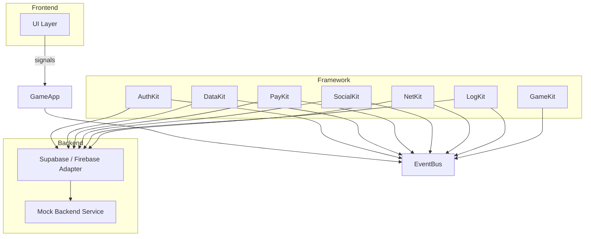
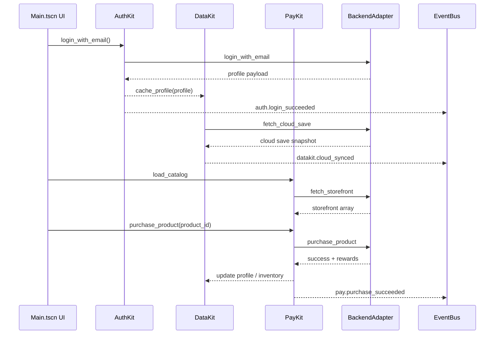

# Architecture Overview

The Godot4 Universal Game Framework is split into layered modules that communicate exclusively through an in-process **EventBus**. This keeps features decoupled and makes it straightforward to swap backend providers (Supabase/Firebase) or add new gameplay services.

```
┌──────────────────────────────┐
│         Frontend UI          │
│ (scenes/Main.tscn, controls) │
└──────────────┬───────────────┘
               │ Signals & events
┌──────────────▼───────────────┐
│       Game Framework          │
│ ┌────────┐  ┌────────┐       │
│ │AuthKit │  │PayKit  │ ...   │
│ └────────┘  └────────┘       │
└──────────────┬───────────────┘
               │ EventBus messages
┌──────────────▼───────────────┐
│     Backend Integration      │
│  SupabaseAdapter / Firebase  │
└──────────────┬───────────────┘
               │ REST/WebSocket
┌──────────────▼───────────────┐
│        Cloud Services        │
│   Supabase / Firebase APIs   │
└──────────────────────────────┘
```

## Event-driven communication

All cross-module communication runs through `addons/universal_framework/core/event_bus.gd`. Modules publish descriptive payloads (plain dictionaries) and subscribe to the topics they care about. This pattern keeps dependencies acyclic and makes it easy to plug in mock or testing modules.

Example topics:

- `auth.login_started`, `auth.login_succeeded`
- `datakit.cloud_synced`
- `pay.purchase_started`, `pay.purchase_succeeded`
- `log.analytics_event_sent`

## GameApp bootstrap

`framework/core/game_app.gd` is autoloaded at runtime and performs the following responsibilities:

1. Instantiate `EventBus`, `LocalizationManager`, and the mock backend service.
2. Create the requested backend adapter via `BackendRegistry.create_adapter`.
3. Register and initialize each framework kit (DataKit → NetKit → AuthKit → PayKit → SocialKit → LogKit → GameKit).
4. Publish `app.initialized` and expose helper getters such as `GameApp.get_auth()`.

## Module dependency chart



## Data flow: demo scenario



## Backend abstraction

Both Supabase and Firebase adapters conform to the same method signatures defined in `backend_adapter.gd`. Each adapter is responsible for:

- Translating kit requests into HTTP/WebSocket calls.
- Handling authentication tokens and retries.
- Normalizing responses into dictionaries understood by the kits.
- Recording analytics or crash reports via provider-specific SDKs.

The repository ships with a `MockBackendService` that implements the same surface to enable rapid prototyping and automated testing without cloud access.

## Extensibility points

- **New kit**: create a script extending `BaseModule`, add it under `addons/universal_framework`, and register it in `GameApp._initialize_modules()`.
- **Custom backend**: implement the `BackendAdapter` interface and register it in `BackendRegistry.create_adapter`.
- **Remote config / AB testing**: add a lightweight module that listens for config update events and publishes the resulting tweaks to interested kits.
- **Platform bridges**: wrap native SDKs (Apple, Google, Steam) using GDNative or C# and expose them behind the `BackendAdapter` or specialized kits.

Refer to the module documents in `docs/framework/modules` for API-level contracts and sample usages.
